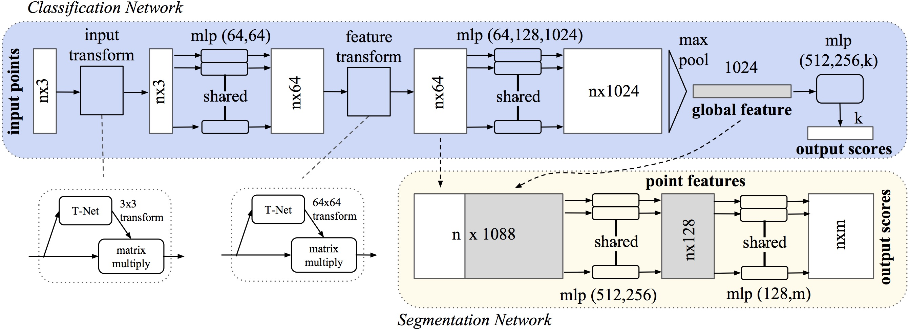

# PointNet Classification with Keras

This repository contains an implementation of PointNet for 3D point cloud classification using Keras. PointNet is a pioneering deep learning architecture designed to process point cloud data directly, making it highly effective for 3D object classification tasks.

## Project Overview

PointNet is a neural network architecture that directly consumes point cloud data, which is a set of points in 3D space. The network learns to extract spatial features from the point cloud data and performs classification tasks effectively.

## Architecture

The implemented PointNet architecture consists of several key components:
- Input transformation network
- Feature transformation network
- Point-wise MLPs
- Global feature aggregation
- Classification network

## Results

The model has been trained on point cloud data and achieves competitive results in classification tasks. Here's a visualization of some predictions:

## Requirements

- TensorFlow 2.x
- Keras
- NumPy
- Matplotlib
- Open3D

## Usage

The main implementation can be found in `Pointnet_Classification_Keras.ipynb`. This Jupyter notebook contains:
- Data preprocessing
- Model implementation
- Training procedure
- Evaluation and visualization

## Contact
If you have any questions or feedback, feel free to contact me at [Maazouz AbdelAziz](https://www.linkedin.com/in/abdelaziz-maazouz/).

## License

This project is licensed under the MIT License - see the LICENSE file for details.

## Acknowledgments

- Original PointNet paper: [PointNet: Deep Learning on Point Sets for 3D Classification and Segmentation](https://arxiv.org/abs/1612.00593)
- The implementation is inspired by various open-source projects and academic resources
